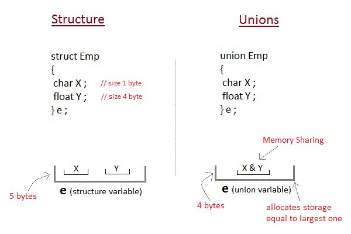
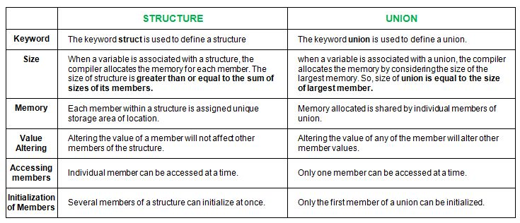

# Section 12: Unions

## Topic: Overview

## Date: 03/12/2025

---

### Cue Column (Questions, Keywords, or Prompts)

- [Insert question or keyword]
- [Insert question or keyword]
- [Insert question or keyword]

---

### Notes Section (Main Notes)

**1. Overview**
- a union is a derived type (similar to a structure) with members that share the same
storage space
  - sometimes the same type of construct needs different types of data
- used mainly in advanced programming applications where it is necessary to store different types of data in the same storage area
  - can be used to save space and for alternating data
  - a union does not waste storage on variables that are not being used
- each element in a union is called member
- you can define a union with many members
  - only one member can contain a value at any given time, so only one access of a member at a given time
- the members of a union can be of any data type
- in most cases, unions contain two or more data types
- it is your responsibility to ensure that the data in a union is referenced with the proper data type
  - referencing data in a union with a variable of the wrong type is a logic error
- the operations that can be performed on a union are
  - assigning a union to another union of the same type
  - taking the address `(&)` of a union variable
  - accessing union members

**2. Examples**
- unions are particularly useful in embedded programming
  - situations where direct access to the hardware/memory is needed
- you could use a union to represent a table that stores a mixture of types in some order
- you could create an array of unions that store equal-sized units
  - each of which can hold a variety of data types
- a union could represent a file containing different record types
- a union could represent a network interface containing different request types

**3. memory allocation for a union**
- although structs are similar to unions, the memory allocated for a union is quite different than for a struct
- every time you create an instance of a struct, the computer will lay out the fields in memory, one after the other
  - allocates storage space for all its members separately
- with a union, all the members have an offset of zero (union)
  - one common storage space for all its members
- a union is created with enough space for its largest field
  - the programmer then decides which value will be stored there
- if you have a union called quantity, with fields called count, weight, and volume
  - whether you set the count, weight, or volume field, the data will go into the same space in memory


- if you want to keep track of a quantity of something
  - quantity might be a count, a weight, or a volume
- you could create a struct like this
```c
typedef struct {
...
short count;
float weight;
float volume;
...
} fruit;
```
- there are a few reasons why this is not a good idea
  - it will take up more space in memory
  - someone might set more than one value
  - there is nothing called “quantity”
- a union should be used in this situation
  - you could specify something called quantity in a data type
  - you can decide for each particular piece of data whether you are going to record a count, a weight, or a volume against it

**4. structs vs unions**
- although unions are similar to structures, they are used for entirely different situations
- you should use a structure when your construct should be a group of other things
- you should use a union when your construct can be one of many different things but only one at a time
- unions are typically used in situations where space is premium but more importantly for exclusively alternate data
- unions ensure that mutually exclusive states remain mutually exclusive
- unions share a common storage space where structures store several data types simultaneously
  - a structure can hold an int and a double and a char
  - a union can hold an int or a double or a char

  


---

### Summary Section (Summary of Notes)

[Insert a brief summary of the key ideas and takeaways]
