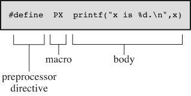

# Section 14: Macros

## Topic: Overview

## Date: 05/12/2025

---

### Cue Column (Questions, Keywords, or Prompts)

- [Insert question or keyword]
- [Insert question or keyword]
- [Insert question or keyword]

---

### Notes Section (Main Notes)

**1. Overview**
- a macro is essentially a piece of code based on the #define directive
  - technically, we have already learned about macro’s when we learned about symbolic constants
- when you first learn about macros, you probably think that they are nothing more than a function call with some strange syntax
  - and you would mostly be right, they “behave” similar to normal functions
- macros are a text processing feature and are “expanded” and replaced by macro definitions
- today, macros in C are considered outdated in terms of modern programming practices
  - however, they are still widely used because they make things easier for the programmer

**2. Syntax**
```c
#define MACRO macro_body
```
- each #define line has three parts
  - the first part is the #define directive itself
  - the second part is your chosen abbreviation, known as a macro name
  - the third part (the remainder of the line) is termed the replacement list or body
    - preprocessor replaces macro name with the macro body

  

**3. Convention**
- you should use capital letters for macro function names
  - not as widespread as that of using capitals for macro constants
  - one good reason for using capitals is to remind yourself to be alert to possible macro side effects
- there are no spaces in the macro name, however, spaces can appear in the replacement string (macro_value)
- macros are also not terminated by a semicolon
- macros run until the first newline following the #
  - limited to one line in length by default unless you use the backslash operator `(\)` for continuation

---

### Summary Section (Summary of Notes)

[Insert a brief summary of the key ideas and takeaways]
