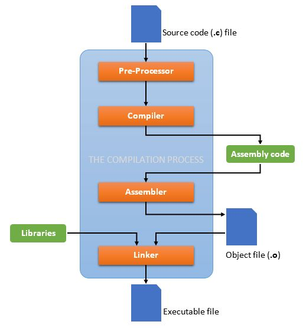

# Section 15: Advanced Debugging, Analysis, and Compiler Opotions

## Topic: Predefined Macros

## Date: 22/12/2025

---

### Cue Column (Questions, Keywords, or Prompts)

- [Insert question or keyword]
- [Insert question or keyword]
- [Insert question or keyword]

---

### Notes Section (Main Notes)

**1. Overview**
- up to this point, we should all understand the compilation process and how to compile and link a program written in the C programming language
- in this lecture, I would like to describe more details about specific options that you can pass to the compiler that will help with the process of debugging, optimization and other enhancements
- the compiler that we are using is the gcc compiler (everyone should have installed this)
  - a very powerful and popular C compiler for various Linux distributions
  - able to use on windows because of Cygwin
    - a Unix-like environment and command-line interface for Windows (also includes the bash shell)
  - able to use a front end version named clang on mac
- when you invoke GCC, it normally does preprocessing, compilation, assembly and linking
  - some of the options to the compiler allow you to stop this process at an intermediate stage
    - for example, the `-c` option says not to run the linker
  - other options are passed on to one stage of processing
    - some options control the preprocessor and others the compiler itself
    - other options control the assembler and linker

**2. Compilation steps**

**3. Overview**
- the gcc program accepts options and file names as operands
  - many options have multi-letter names
    - therefore multiple single-letter options may not be grouped
      - `-dr` is very different from `-d` `-r`
- you can mix options and other arguments
- for the most part, the order you use does not matter
- order does matter when you use several options of the same kind
  - for example, if you specify -L more than once, the directories are searched in the order specified
- many options have long names starting with -f or with -W--for example
  - `-fforce-mem`, `-fstrength-reduce`, `-Wformat` and so on

---

### Summary Section (Summary of Notes)
- [GCC online documentation](https://gcc.gnu.org/onlinedocs/gcc-15.2.0/gcc.pdf)

[Insert a brief summary of the key ideas and takeaways]
