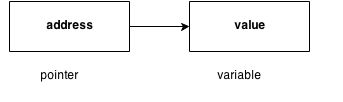
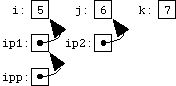
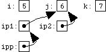
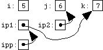

# Section 15: Advanced Debugging, Analysis, and Compiler Opotions

## Topic: Double pointer (pointer to pointer)

## Date: 28/12/2025

---

### Cue Column (Questions, Keywords, or Prompts)

- [Insert question or keyword]
- [Insert question or keyword]
- [Insert question or keyword]

---

### Notes Section (Main Notes)

**1. Overview**
- we have a good understanding of the concept of pointers (indirection)
- we can create pointers to int, pointers to a char, pointers to structures, really any data type
- in this lecture, we will discuss the concept of pointers to other pointers
- a form of multiple indirection, or a chain of pointers
- we understand the distinction between the pointer itself and what it points to
- this will help with understanding the concept of pointers to pointers
- we now have to distinguish between the pointer, what it points to, and what the pointer that it points
to points to
- when a pointer holds the address of another pointer, this is known as a pointer-to-pointer or double
pointer
- in theory, we might also end up with pointers to pointers to pointers, or pointers to pointers to pointers to
pointers
- although triple and more pointers are hardly ever used and should not be
- a pointer points to a location in memory and thus used to store the
address of variables

- with a double pointer, the first pointer contains the address of the
second pointer, which points to the location that contains the actual
value


**2. Syntax of a double pointer**
- a variable that is a pointer to a pointer is declared by placing an additional
asterisk in front of its name
- two asterisks indicate that two levels of pointers are involved
- the following declaration declares a pointer to a pointer of type int
```c
int **var;
```
- when a value is indirectly pointed to by a pointer to a pointer, accessing
that value requires that the asterisk operator be applied twice
```c
int x = **var;
```

**3. Conceptual example**
```c
// declaring a double pointer
int **ipp;
// declaring some ints
int i = 5, j = 6; k = 7;
// initializing some pointers
int *ip1 = &i, *ip2 = &j;
// assigning our double pointer
ipp = &ip1;
```


- ipp points to ip1 which points to I
- `*ipp` is `ip1`
- `**ipp` is `I (5)`
- if we now change ipp
```c
*ipp = ip2;
```

- we have changed the pointer pointed to by ipp (that is, `ip1`) to contain a copy of `ip2`
- `ip1` now points at `j`
- If we now change ipp
```c
*ipp = &k;
```

- we have now changed the pointer pointed to by `ipp` (that is, `ip1` again) to point to `k`

**4. Use cases**
- the biggest reason to use a double pointer is when you need to change the value of the pointer passed to a function as the function argument
  - simulate pass by reference (remember, everything in C is pass by value/copy)
- If you pass a single pointer in as an argument
  - you will be modifying local copies of the pointer, not the original pointer in the calling scope
  - with a pointer to a pointer, you modify the original pointer
- use a double pointer as an argument to a function when you want to preserve the memory-allocation or assignment even outside of the function

**5. Other use cases**
- there are other uses too, like the main() argument of every C program has a pointer to a pointer for argv
  - each element holds an array of chars that are the command line options
- you must be careful though when you use pointers of pointers to point to 2 dimensional arrays
  - better to use a pointer to a 2 dimensional array instead
```c
void test() {
  double **a;
  int i1 = sizeof(a[0]); //i1 == 4 == sizeof(double*)

  double matrix[ROWS][COLUMNS];
  int i2 = sizeof(matrix[0]);
  //i2 == 240 == COLUMNS * sizeof(double)
}
```
- here is an example of a pointer to a 2 dimensional array done properly:
```c
int (*myPointerTo2DimArray)[ROWS][COLUMNS]
```
---

### Summary Section (Summary of Notes)

[Insert a brief summary of the key ideas and takeaways]
