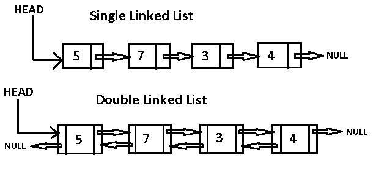

# Section 19: Data Structures

## Topic: Linked list (Overview)

## Date: 07/02/2025

---

### Cue Column (Questions, Keywords, or Prompts)

- [Insert question or keyword]
- [Insert question or keyword]
- [Insert question or keyword]

---

### Notes Section (Main Notes)

**1. Overview**
- a linked list is an example of an abstract data structure
- it can be used to store a lot of different kinds of data
  - it is the second most used data structure after the array
  - there is no linked list data type in C, so you have to create your own
  - it is a linear data structure
- it is a sequence of data structures which are connected together via links/nodes
  - each link contains data items (elements)
- there are different types of linked lists
  - single linked list
    - can only be parsed one-way (forward)
  - double linked list
    - previous and next pointers, can be traversed forward and backward
- linked lists are dynamic
  - the length of a list can increase or decrease as necessary
- a linked list can be used when the number of data elements to be represented in the data structure is unpredictable
- a node/link can contain data of any type including other struct objects
- linked lists can be maintained in sorted order by inserting each new element at the proper point in the list

**2. Linked lists and pointers**
- linked lists heavily use pointers in its implementation
  - understanding pointers is crucial to understanding how linked lists work
  - you must also be familiar with dynamic memory allocation and structures
- linked lists work like an array that can grow and shrink as needed, from any point in the array
- linked lists are accessed via a pointer to the first node of the list
- the link pointer in the last node of a list is set to NULL to mark the end of the list
- Self-referential structures: a structure that contains a pointer to another structure of the same type
```c
struct Node {
    int data;
    struct Node* next;
};
```

**3. Links/Nodes**
- each node contains the following
  - a piece of data
  - the first node/link is often referred to as the head node/link
  - each node/link also contains a connection to another node/link
    - this is referred to as the next node/link
    - the last node/link points to `NULL`
- in order to traverse the list, you follow the pointer from each node/link to the next
- prepending to a list is very fast
- inserting into a sorted list is very fast

**4. Illustration**



**5. linked lists vs. arrays**
- arrays are a fixed size
  - must know the upper limit on the number of elements in advance
- an array can be declared to contain more elements than the number of data items expected
  - this can waste memory
- linked lists can provide better memory utilization than arrays
  - using dynamic memory allocation that grow and shrink at execution time
    - however, extra memory space for a pointer is required with each element of the linked list (more overhead)
    - increases the risk of memory leaks and segment faults
- Insertion and deletion in a sorted array can be time consuming
  - all the elements following the inserted or deleted element must be shifted appropriately
- the elements of an array are stored contiguously in memory
  - allows immediate access to any array element
- linked list elements are not stored at a contiguous location
  - elements are linked using pointers
  - have to access elements sequentially starting from the first node/link

---

### Summary Section (Summary of Notes)

[Insert a brief summary of the key ideas and takeaways]
