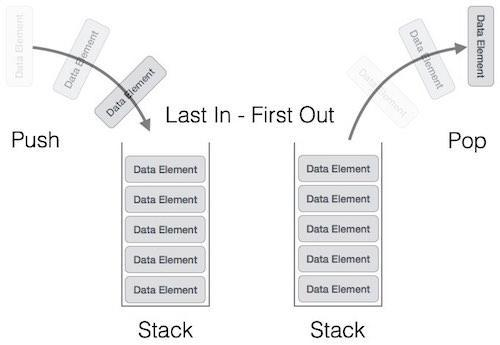

# Section 19: Data Structures

## Topic: Stacks (Overview)

## Date: 11/02/2025

---

### Cue Column (Questions, Keywords, or Prompts)

- [Insert question or keyword]
- [Insert question or keyword]
- [Insert question or keyword]

---

### Notes Section (Main Notes)

**1. Overview**
- a stack is a constrained version of a linked list
- all insertions and deletions are only made at the top of the stack
- the last item to be put in to the stack is always the first item to be removed
  - referred to as a last-in, first-out (LIFO) data structure
- a stack is referenced via a pointer to the top element of the stack
  - the link member in the last node of the stack is set to NULL to indicate the bottom of the stack
- not setting the link in the bottom node of a stack to NULL can lead to runtime errors
- stacks and linked lists are represented identically
  - difference is that insertions and deletions may occur anywhere in a linked list, but only at the top of a stack

**2. Basic Operations**
- the primary functions used to manipulate a stack are the push and pop function
- push inserts a new element and places it on top of the stack
- pop removes an element from the top of the stack
  - frees the memory that was allocated and returns the element
- other operations include
  - peek – looking at an element at the top without removing it
  - isEmpty – checking if the stack is empty

**3. Illustration**

- References: https://www.tutorialspoint.com/data_structures_algorithms/stack_algorithm.htm

**4. Applications**
- stacks support recursive function calls
  - whenever a call is made, the function must know how to return to its caller, so the return address is pushed onto a stack
  - if a series of function calls occurs, the successive return values are pushed onto the stack in last-in,first-out order so that each function can return to its caller
- stacks are used to store data in memory
  - contain the space created for automatic variables on each invocation of a function
  - when the function returns the space for those variables is popped off the stack
- the call stack is useful when debugging
  - shows each function call and any nested function calls
- stacks are used by compilers in the process of evaluating expressions and generating machine language code
  - balancing symbols (matching starting and ending brackets, parenthesis)
- stacks can be used when implementing page visited history in a web browser
- a stack could be used as an “undo” operation in a text editor
- a stack can be used to implement post-fix notation in a computer language ( order of
operations and operands)
  - infix to Postfix /Prefix conversion
- used in many algorithms like Tower of Hanoi, tree traversals, stock span problem, histogram problem
- an application to reverse a string could use a stack
  - push each letter of the string on to the stack
  - then pop them back (string is now reversed)

---

### Summary Section (Summary of Notes)

[Insert a brief summary of the key ideas and takeaways]
