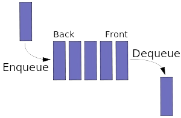

# Section 19: Data Structures

## Topic: Queues (Overview)

## Date: 11/02/2025

---

### Cue Column (Questions, Keywords, or Prompts)

- [Insert question or keyword]
- [Insert question or keyword]
- [Insert question or keyword]

---

### Notes Section (Main Notes)

**1. Overview**
- another common data structure is the queue
- a queue is similar to a checkout line in a grocery store
  - the first person in line is serviced first
  - other customers enter the line only at the end and wait to be serviced
- queue elements are removed only from the head of the queue
- queue elements are inserted only at the tail of the queue
- a queue is referred to as a first-in, first-out (FIFO) data structure
  - try not to confuse a queue with a stack
  - a stack works based on the last-in-first-out (LIFO) principle
  - the difference between stacks and queues is in removing
    - in a stack we remove the item that was most recently added
    - in a queue, we remove the item that was least recently added
- there are two main operations in a queue
  - enqueue
  - dequeue
- enqueue will insert an element into the back of the queue
- dequeue will remove an element from the front of the queue
- other operations
  - IsEmpty - check if queue is empty
  - IsFull - check if queue is full
  - peek - get the value of the front of queue without removing it
  - poll or offer (same as dequeue and enqueue)

- Reference: https://en.wikipedia.org/wiki/Queue_(abstract_data_type)

**2. Queue Applications**
- some computers have only a single processor, so only one user at a time may be serviced
  - entries for the other users are placed in a queue
  - each entry gradually advances to the front of the queue as users receive service
  - the entry at the front of the queue is the next to receive service
- queues are also used to support print spooling
  - a multiuser environment may have only a single printer
  - many users may be generating outputs to be printed
  - If the printer is busy, other outputs may still be generated
    - these are spooled to disk where they wait in a queue until the printer becomes available
- Information packets also wait in queues in computer networks
  - each time a packet arrives at a network node, it must be routed to the next node on the network
  - the routing node routes one packet at a time
    - additional packets are enqueued until the router can route them
- basically, when a resource is shared among multiple consumers, queues are often utilized

**3. Advantages**
- speed
  - data queues are a fast method of inter-process communication
  - data queues free up jobs from performing some work
    - can lead to a better response time and an overall improvement in system performance
  - data queues serve as the fastest form of asynchronous communication between two different tasks
    - there is less overhead than with database files and data areas
- flexibility
  - queues are flexible, requiring no communications programming
  - the programmer does not need any knowledge of inter-process communication
  - data queues allow computers to handle multiple tasks
  - the queue can remain active when there are no entries and ready to process data entries when necessary

---

### Summary Section (Summary of Notes)

[Insert a brief summary of the key ideas and takeaways]
