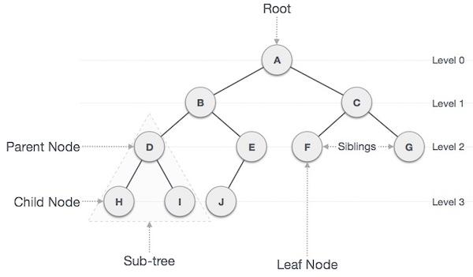
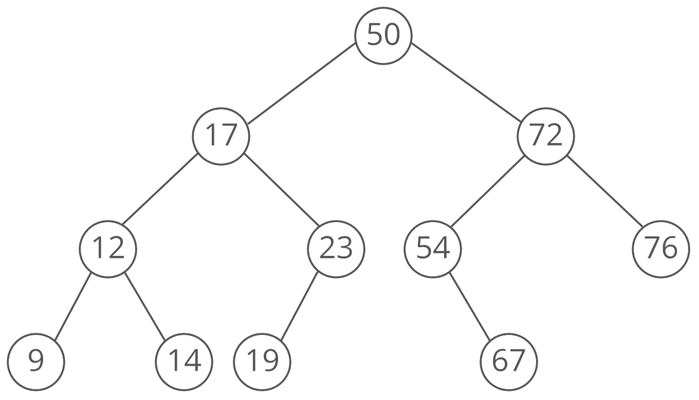
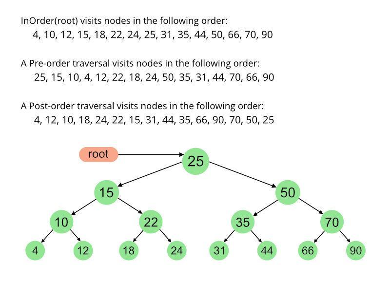

# Section 19: Data Structures

## Topic: Binary Trees (Implementation)

## Date: 16/02/2025

---

### Cue Column (Questions, Keywords, or Prompts)

- [Insert question or keyword]
- [Insert question or keyword]
- [Insert question or keyword]

---

### Notes Section (Main Notes)

**1. Overview**
- linked lists, stacks and queues are linear data structures
- a tree is a nonlinear, two-dimensional data structure with special properties
- trees whose nodes contain a maximum of two links are called binary trees
- none, one, or both of which may be NULL
- the root node is the first node in a tree
- each link in the root node refers to a child
- the left child is the first node in the left subtree
- the right child is the first node in the right subtree
- the children of a node are called siblings
- a node with no children is called a leaf node

**2. Illustration**

- computer scientists normally draw trees from the root node down
- exactly the opposite of trees in nature

**3. Applications**
- often used in search, game logic, autocomplete tasks, and graphics
- the most common use of a binary tree is a binary search tree
- used in many search applications where data is constantly entering/leaving
- map and set objects in many libraries
- binary space partition algorithm
- used in almost every 3D video game to determine what objects need to be rendered
- used in many high-bandwidth routers for storing router-tables
- different forms of binary trees are used by compilers to parse expressions
- data compression algorithms
- database problems like indexing

**4. Binary search trees**
- a binary search tree is a linked structure that incorporates the binary search algorithm
- ordered data structure
- allows for fast lookup, addition and removal of items
- a fundamental data structure used to construct more abstract data structures
such as sets, multisets, and associative arrays
- a binary search tree has the following properties
- values in any left subtree are less than the value in its parent node
- values in any right subtree are greater than the value in its parent node
- is considered balanced if every level of the tree is fully filled with the exception of the last level
- on the last level, the tree is filled left to right
- a perfect BST is one in which it is both full and complete
- all child nodes are on the same level and each node has a left and a right child node
- a binary search tree has no duplicate node values
- an attempt to insert a duplicate value will be recognized when creating the tree
- a duplicate will follow the same “go left” or “go right” decisions on each comparison as the
original value did
- the duplicate will eventually be compared with a node in the tree containing the same
value
- duplicate value is discarded at this point
- a node can only be inserted as a leaf node in a binary search tree

- Reference page: https://www.interviewcake.com/concept/java/binary-search-tree
- searching a binary tree for a value that matches a key value is fast
- if the tree is tightly packed, each level contains about twice as many elements as the previous level
- suppose you want to find an item (target)
- if the item precedes the root item, you need to search only the left half of the tree
- if the target follows the root item, you need to search only the right subtree of the root node
- one comparison eliminates half the tree
- suppose you search the left half
- means comparing the target with the item in the left child
- if the target precedes the left-child item, you need to search only the left half of its descendants,
and so on
- each comparison cuts the number of potential matches in half
- a binary search tree combines a linked structure with binary search efficiency

**5. Basic operations on a binary search tree**
- insert
- Inserts an element in a tree/create a tree
- search
- searches an element in a tree
- trees can be traversed in different ways because they are non-linear (inorder, preorder, postorder)
- inorder traversal
- gives nodes in non-decreasing order
- the steps are
- traverse the left subtree in-order
- process the value in the node
- traverse the right subtree in-order
- the value in a node is not processed until the values in its left subtree are processed
- prints the node values in ascending order
- preorder traversal
- used to create a copy of the tree
- the value in each node is processed as the node is visited
- the values in the left subtree are then processed
- then the values in the right subtree are processed
- postorder traversal
- used to delete the tree the steps are
- traverse the left subtree post-order
- traverse the right subtree post-order
- then process the value in the node
- the value in each node is not processed until the values of its children are
processed

- Reference page: https://www.geeksforgeeks.org/tree-traversals-inorder-preorder-and-postorder/
- Inorder (Left, Root, Right)
- Preorder (Root, Left, Right)
- Postorder (Left, Right, Root)

---

### Summary Section (Summary of Notes)

[Insert a brief summary of the key ideas and takeaways]
