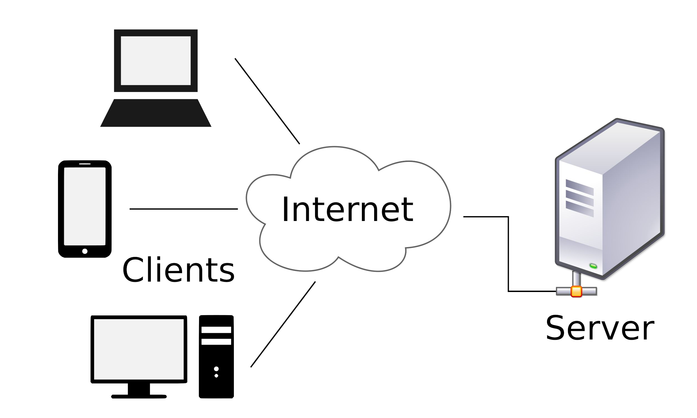

# Section 22: Networking (Sockets)

## Topic: Overview

## Date: 24/02/2026

---

### Cue Column (Questions, Keywords, or Prompts)

- [Insert question or keyword]
- [Insert question or keyword]
- [Insert question or keyword]

---

### Notes Section (Main Notes)

**1. Overview**
- programs on different machines often need to talk to each other
- we have already learned how to use I/O to communicate with files
- we have learned how processes on the same machine can communicate with each other
- luckily, C is used to write most of the low-level networking code on the Internet
- In this section, we are going to learn how to write C programs that can talk to other programs across the network and across the world
- most networked applications need two separate programs
  - a server and a client
- the goal of this section is to be able to create programs that act as servers and programs that act as clients

**2. TCP protocol**
- TCP (Transmission Control Protocol) is a standard that defines how to establish and maintain a network conversation through which application programs can exchange data
- TCP works with the Internet Protocol (IP), which defines how computers send packets of data to each other
- together, TCP and IP are the basic rules defining the Internet
  - all major Internet applications such as the World Wide Web, email, remote administration, and file transfer rely on TCP
- TCP is a connection-oriented protocol
  - means a connection is established and maintained until the application programs at each end have finished exchanging messages
- TCP creates a connection between the source and destination node before transmitting the data and keeps the connection alive until the communication is no longer active

**3. Features of a TCP connection**
- Connection Oriented
- Handles duplicated packets
- Reliability
- Full Duplex
- Handles lost packets
- Flow Control
- Handles packet sequencing
- Congestion Control

**4. Client/Server model**
- the Client-Server model is a relationship in which one program (the client) requests a service or resource from another program (the server)
  - two processes or two applications that communicate with each other to exchange some information
  - one of the two processes acts as a client process, and another process acts as a server
  - there can be multiple clients that talk to one server
- clients typically communicate with servers by using the TCP/IP protocol suite
- computer transactions in which the server fulfills a request made by a client are very common
  - the client-server model has become one of the central ideas of network computing
- the client establishes a connection to the server over a local area network (LAN) or wide-area network (WAN), such as the Internet
  - clients need to know the address of the server, but the server does not need to know the address or even the existence of the client prior to the connection being established
- once the server has fulfilled the client's request, the connection is terminated
- because multiple client programs share the services of the same server program, a special server called a daemon may be activated just to await client requests

- as mentioned, the client process makes a request for information and after getting the response, this process may terminate or may do some other processing
- an example of a client program would be an Internet Browser
  - sends a request to the Web Server to get one HTML webpage
- the server process is takes a request from one or more clients
- after getting a request from the client, this process will perform the required processing, gather the requested information, and send it to the requestor client
- once done, it becomes ready to serve another client
- server processes are always alert and ready to serve incoming requests
- an example of a server process would be a Web Server
  - keeps waiting for requests from Internet Browsers and as soon as it gets any request from a browser, it picks up a requested HTML page and sends it back to that Browser

**5. Types of Servers**
- there are two types of servers you can implement
- **Iterative Server**
  - the simplest form of a server where the server process serves one client at a time
  - after completing the first request, it takes request from another client
  - other client wait until it is their turn
- **Concurrent Servers**
  - this type of server runs multiple concurrent processes to serve many requests at a time
  - one process may take longer and another client does not need to wait too long
  - the simplest way to write a concurrent server under Unix is to fork a child process to handle each client separately

**6. Sockets**
- sockets are the "virtual" endpoints of any kind of network communications done between two computers
- socket programming is a way of connecting two nodes on a network to communicate with each other
- one socket(node) listens on a particular port at an address
- another socket reaches out to the other to form a connection
- server forms the listener socket while client reaches out to the server
- when you type www.google.com in your web browser
  - it opens a socket and connects to google.com to fetch the page and show it to you
  - same with any chat client like gtalk or skype
- all network communication goes through a socket
- sockets are supported by Unix, Windows, Mac, and many other operating systems

**7. Steps in using sockets to communicate**
- create a new socket for network communication
- actively attempt to establish a connection (connect)
- attach a local address to a socket (bind)
- send some data over connection (send)
- announce willingness to accept connections (listen)
- receive some data over connection (receive)
- block caller until a connection request arrives (accept)
- release the connection (close)

---

### Summary Section (Summary of Notes)

[Insert a brief summary of the key ideas and takeaways], NULL, thread_function, 