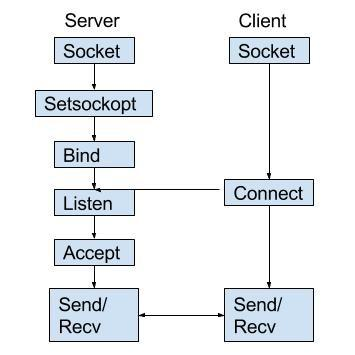
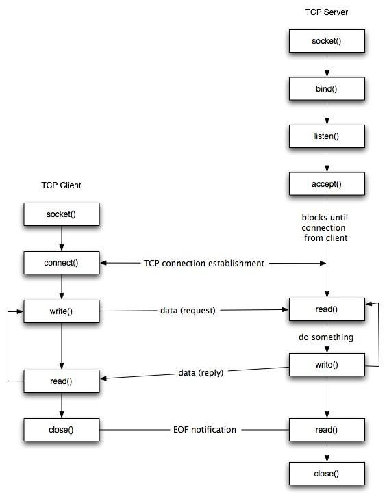

# Section 22: Networking (Sockets)

## Topic: Creating a Client Socket

## Date: 25/02/2026

---

### Cue Column (Questions, Keywords, or Prompts)

- [Insert question or keyword]
- [Insert question or keyword]
- [Insert question or keyword]

---

### Notes Section (Main Notes)

**1. Steps in using sockets to communicate**
- create a new socket for network communication
- attach a local address to a socket (bind)
- announce willingness to accept connections (listen)
- block caller until a connection request arrives (accept)
- actively attempt to establish a connection (connect)
- send some data over connection (send)
- receive some data over connection (receive)
- release the connection (close)

**2. Steps specifically for a client socket**
- create a socket with the socket() system call
- connect the socket to the address of the server using the connect() system call
- send and receive data
  - there are a number of ways to do this, but the simplest way is to use the read()/recv and write()/send system calls

**3. Illustration**





**4. simple client steps (pseudocode)**
```
my_sd = socket( )
his_sd = connect( my_sd, <presumed adderss of some server> )
send( his_sd, <the stuff you want sent> )
recv( his_sd, <where to put what you receive> )
close( my_sd )
```

---

### Summary Section (Summary of Notes)

[Insert a brief summary of the key ideas and takeaways]