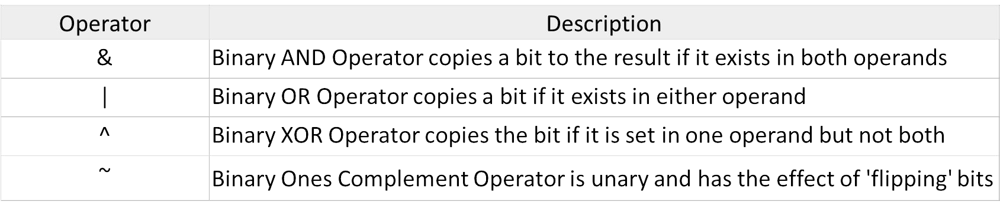
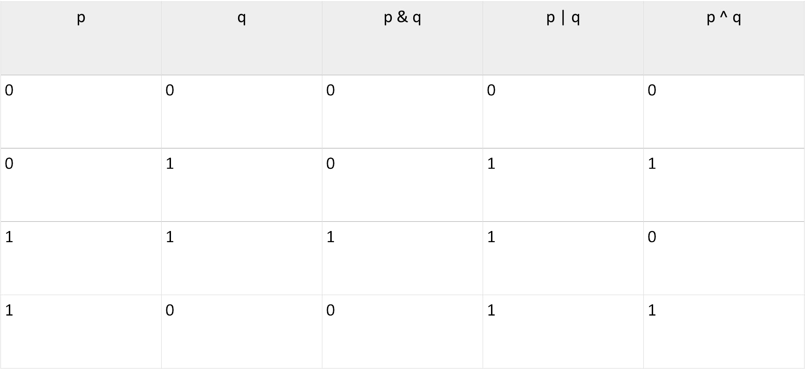

# Section 7: Type Qualifiers

## Topic: Binary numbers and bits

## Date: 07/11/2025

---

### Cue Column (Questions, Keywords, or Prompts)

- [Insert question or keyword]
- [Insert question or keyword]
- [Insert question or keyword]

---

### Notes Section (Main Notes)

**1. Overview**
- bit manipulation is the act of algorithmically manipulating bits or other pieces of data shorter
than a word
- computer programming tasks that require bit manipulation include
  - low-level device control
  - error detection
  - correction algorithms
  - data compression
  - encryption algorithms
  - optimization
- a bitwise operation operates on one or more binary numbers at the level of their individual bits
  - used to manipulate values for comparisons and calculations
  - substantially faster than division, several times faster than multiplication, and sometimes significantly faster than addition

**2. Bitwise Logical Operators**
- C offers bitwise logical operators and shift operators
  - operate on the bits in integer values




- they operate on each bit independently of the bit to the left or right
  - do not confuse them with the regular logical operators (&&, ||, and !), which operate on values
- all of the logical operators listed in the table (with the exception of the ones complement operator ~) are binary operators
  - take two operands

**3. Use case**
- bit operations can be performed on any type of integer value in C
  - int, short, long, long long, and signed or unsigned
  - and on characters, but cannot be performed on floating-point values
- a bit mask is data that is used for bitwise operations
  - using a mask, multiple bits in a Byte can be set either on, off or inverted from on to off (or vice versa) in a single bitwise operation
- one major use of the bitwise `AND`, `&`, and the bitwise `OR`, `|`, is in operations to test and set individual bits in an integer variable
  - can use individual bits to store data that involve one of two choices
- you could use a single integer variable to store several characteristics of a person
  - store whether the person is male or female with one bit
  - use three other bits to specify whether the person can speak French, German, or Italian
  - another bit to record whether the person’s salary is $50,000 or more
  - in just four bits you have a substantial set of data recorded

**4. Ones compliment operator : ~**
- useful when you do not know the precise bit size of the quantity that you are dealing with in an operation
  - can help make a program more portable
- to set the low-order bit of an int called w1 to 0, you can AND w1 with an int consisting of all 1s except for a single 0 in the rightmost bit
```c
w1 &= 0xFFFFFFFE;
```
- works fine on machines in which an integer is represented by 32 bits
- if you replace the preceding statement with
```c
w1 &= ~1;
```
- w1 gets ANDed with the correct value on any machine because the ones complement of 1 is calculated and
consists of as many leftmost one bits as are necessary to fill the size of an int (31 leftmost bits on a 32-bit integer system)

**5. Summary**
- one of the features that sets C apart from most high-level languages is its ability to access individual bits in an integer
  - often is the key to interfacing with hardware devices and with operating systems
- C features several bitwise operators
  - operate independently on each bit within a value
- the bitwise negation operator (~) inverts each bit in its operand, converting 1s to 0s, and vice versa
- the bitwise AND operator (&) forms a value from two operands
  - each bit in the value is set to 1 if both corresponding bits in the operands are 1
  - otherwise, the bit is set to 0
- the bitwise `OR` operator `(|)` also forms a value from two operands
  - each bit in the value is set to 1 if either or both corresponding bits in the operands are 1
  - otherwise, the bit is set to 0
- the bitwise **EXCLUSIVE OR operator** `(^)` acts similarly, except that the resulting bit is set to 1 only if one or the other, but
not both, of the corresponding bits in the operands is 1

**6. Truth Table**


--- 

### Summary Section (Summary of Notes)

[Insert a brief summary of the key ideas and takeaways]
