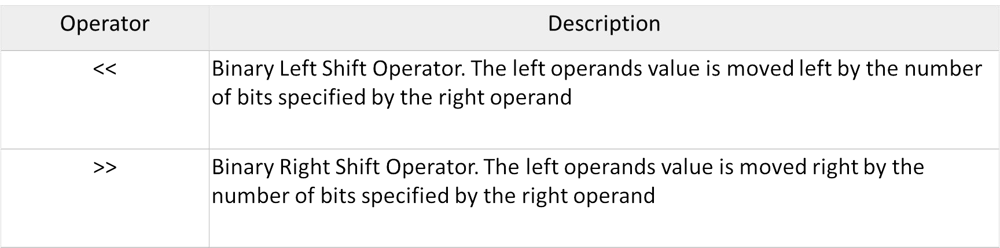

# Section 7: Type Qualifiers

## Topic: Binary numbers and bits

## Date: 07/11/2025

---

### Cue Column (Questions, Keywords, or Prompts)

- [Insert question or keyword]
- [Insert question or keyword]
- [Insert question or keyword]

---

### Notes Section (Main Notes)

**1. Overview**
- C also has left-shift (<<) and right-shift (>>) operators
  - each produces a value formed by shifting the bits in a pattern the indicated number of bits to the left or right
- for the left-shift operator, the vacated bits are set to 0
- for the right-shift operator, the vacated bits are set to 0 if the value is unsigned



**2. Left Shift Operator (<<)**
- shifts the bits of the value of the left operand to the left by the number of places given by the right operand
  - the vacated positions are filled with 0s (low-order bit of the value)
  - bits moved past the end of the left operand are lost (the high-order bit of the value)
- if `w1` is equal to `3`, then the expression
```c
w1 = w1 << 1;
```
- results in 3 being shifted one place to the left
- which results in `6` being assigned to `w1`
```c
w1        ... 000 011 03
w1  << 1  ... 000 110 06
(10001010) << 2 // expression, 138
(00101000)
// resulting value 40
int x= 1;
int y;
y = x<< 2; /* assigns 4 to y*/
x<<= 2;
/* changes x to 4 */
```
- left shifting has the effect of multiplying the value that is shifted by two

**3. Right Shift Operator (>>)**
- the right shift operator >> shifts the bits of a value to the right
  - bits shifted out of the low-order bit of the value are lost (past the right end of the left operand)
- right shifting an unsigned value always results in 0s being shifted in on the left (through the high-order
bits)
- If `w1` is an unsigned int, which is represented in 32 bits, and `w1` is set equal to `4151832098`
```c
w1 >>= 1;
```
- sets `w1` equal to hexadecimal `2075916049`
```c
w1      1111 0111 0111 0111 1110 1110 0010 0010     4151832098
w1 >> 1 0111 1011 1011 1011 1111 0111 0001 0001     2075916049

(10001010) >> 2 // expression, signed value, 138
(00100010)      // resulting value, some systems 34
(10001010) >> 2 // expression, signed value, 138
(11100010)      // resulting value, other systems, 226
```
- for an unsigned value, you have the following:
```c
(10001010) >> 2 // expression, unsigned value
(00100010)      // resulting value, all system
```
- each bit is moved two places to the right, and the vacated places are filled with 0s
- right shifting has the effect of dividing the value that is shifted by two

**4. Undefined results**
- if you shift a value to the left or right by an amount that is greater
than or equal to the number of bits in the size of the data item you
will get a undefined result
  - on a machine that represents integers in 32 bits
    - shifting an integer to the left or right by 32 or more bits is not guaranteed to produce a defined result in your program
- also if you shift a value by a negative amount, the result is also
undefined

--- 

### Summary Section (Summary of Notes)

[Insert a brief summary of the key ideas and takeaways]
