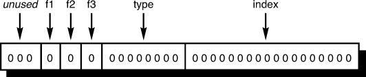

# Section 7: Type Qualifiers

## Topic: Using Bit Operators to pack data

## Date: 14/11/2025

---

### Cue Column (Questions, Keywords, or Prompts)

- [Insert question or keyword]
- [Insert question or keyword]
- [Insert question or keyword]

---

### Notes Section (Main Notes)

**1. Overview**
- we understand that you can perform all sorts of sophisticated operations on bits
  - often performed on data items that contain packed information
- you can pack information into the bits of a byte if you do not need to use the entire byte to represent the data
  - flags that are used for a boolean true or false condition can be represented in a single bit on a computer
- two methods are available in C that can be used to pack information together to make better use of memory
  - **bit fields** and **bitwise** operators
- you could use an unsigned int/long variable to hold the same information
- `OR` you could use a structure the same size as `unsigned int` to hold state information
- we will discuss the first option
  - represent the data inside a normal int and then access the desired bits of the int using the bit operators with a bitmask
  - this is a bit more awkward to do (than bit fields)

**2. pack information into an int/long variable**
- if you need to store many flags inside a large table, the amount of memory that is wasted could become significant
- an int or a long can be used to conserve memory space
- flags that are used for a boolean true or false condition can be represented in a single bit on a computer
  - each bit in the int can be set to 1 (true) or 0 (false)
```c
10111001
```
- we can access the desired bits of the int using the bit operators provided by C
  - first bit is true, second bit is false, third bit is true (each bit represents a flag)
  - we are essentially storing eight different values in a single int

**3. Example**
- suppose you want to pack five data values into a word because you have to maintain a very large table of
these values in memory
  - assume that three of these data values are flags (f1, f2, and f3)
  - the fourth value is an integer called type, which ranges from 1 to 255
  - the final value is an integer called index, which ranges from 0 to 100,000
- storing the values of the flags `f1`, `f2`, and `f3` only requires three bits of storage
  - one bit for the `true`/`false` value of each flag
- storing the value of the `int` type requires eight bits of storage
- storing the value of the `integer` index requires 18 bits
- the total amount of storage needed to store the five data values is 29 bits
- you could define an `integer` variable that could be used to contain all five of these values
```c
unsigned int packed_data; // 32 bits on most systems
```
- you can then arbitrarily assign specific bits or fields inside packed_data to
be used to store the five data values
  - packed_data has three unused bits



**Setting bits:**
- you can apply the correct sequence of bit operations to packed_data to set and retrieve values to and from the fields of the int
- to set the type field of packed_data to 7
  - shift the value 7 to the left the appropriate number of places and then OR it into packed_data
```c
packed_data |= 7 << 18;
```
- to set the type field to the value n, where n is between 0 and 255
  - to ensure that n is between 0 and 255, you can AND it with 0xff before it is shifted
```c
packed_data |= n << 18;
```
- the statements on the previous slide only work if you know that the type field is zero
  - to zero out the type field, you need to first AND it with a value (bitmask) that consists of 0s in the eight bit locations of the type field and 1s everywhere else
```c
packed_data &= 0xfc03ffff;
```
- to save yourself of having to calculate the bitmask and also to make the operation independent of the size of an integer
  - you could instead use the below statement to set the type field to zero
```c
packed_data &= ~(0xff << 18);
```
- combining the statements described previously, you can set the type field of packed_data to the value contained in the eight low-order bits of n
```c
packed_data = (packed_data & ~(0xff << 18)) | ((n & 0xff) << 18);
```
- you can see how complex the above expression is for accomplishing the relatively simple task of setting the bits in the type field to a specified value

**Reading bits:**
- extracting a value from one of these fields is not as complicated as setting bits
  - the field can be shifted into the low-order bits of the word and then AND’ed with a mask of the appropriate bit length
- to extract the type field of packed_data and assign it to `n`
```c
n = (packed_data >> 18) & 0xff;
```

**4. Another example**
- you can use an unsigned long value to represent color values
  - the low-order byte holding the red intensity
  - the next byte holding the green intensity
  - the third byte holding the blue intensity
- you store the intensity of each color in its own unsigned char variable and use a bit mask to set/read
```c
#define BYTE_MASK 0xff
unsigned long color = 0x002a162f;
unsigned char blue, green, red;
red = color & BYTE_MASK;
green = (color >> 8) & BYTE_MASK;
blue = (color >> 16) & BYTE_MASK;
```
- the code uses the right-shift operator to move the 8-bit color value to the low-order byte
  - then uses the mask technique to assign the low-order byte to the desired variable
- the long color variable can be used to calculate three other colors (without using additional variables)

--- 

### Summary Section (Summary of Notes)

[Insert a brief summary of the key ideas and takeaways]
