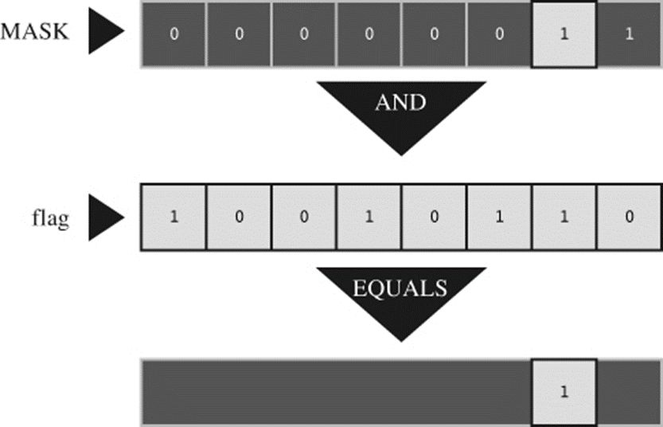

# Section 8: Bit Manipulation

## Topic: Binary numbers and bits

## Date: 07/11/2025

---

### Cue Column (Questions, Keywords, or Prompts)

- [Insert question or keyword]
- [Insert question or keyword]
- [Insert question or keyword]

---

### Notes Section (Main Notes)

**1. Overview**
- a bit mask is data that is used for bitwise operations
  - a bit pattern with some bits set to **on** (1) and some bits to **off** (0)
- a mask can be used to set multiple bits in a byte to either on, off or inverted from on to off (or vice versa) using a single bitwise operator
- imagine you want to create a program that holds a state, which is based on multiple values that are one(true) or zero(false)
  - can store these values in different variables (booleans or integers)
  - or instead use a single integer variable and use each bit of its internal 32 bits to represent the different true and false values
```c
00000101
```
- the **first** bit (reading from right to left) is true, which represents the first variable
- the **2nd** is false, which represents the 2nd variable. The third true. And so on.
- a very efficient way of storing data and has many usages
- bit masking allows you to use the C bitwise operators to manipulate the bits of an integer
  - checking if particular bit values are present or not
  - setting bits to off or on
- you apply a mask to a value to set or read the desired states of an integer variable
- to avoid information peeking around the edges, a bit mask should be at least **as wide as** the value it’s masking

**2. Using a bit mask with AND**
- the bitwise `AND` operator is often used with a mask
- suppose you define the symbolic constant MASK as 2 (binary `00000010`)
  - only bit number 1 being nonzero
```c
flags = flags & MASK;
```
- the above would cause all the bits of flags (except bit 1) to be set to 0
  - any bit combined with 0 using the `&` operator yields `0`
  - bit number 1 will be left unchanged
    - If the bit is 1, 1 & 1 is 1
    - if the bit is 0, 0 & 1 is 0
- we are “using a mask” because the zeros in the mask hide the corresponding bits in flags

**3. bit mask with AND Example**

- you can think of the 0s in the mask as being opaque and the 1s as being transparent
- the expression flags & MASK is like covering the flags bit pattern with the mask
  - only the bits under MASK’s 1s are visible

**4. Turning Bits On (Setting Bits) using OR**
- you often need to turn on particular bits in a value while leaving the remaining bits unchanged
  - an IBM PC controls hardware through values sent to ports
  - to turn on the internal speaker, you might have to turn on the 1 bit while leaving the others unchanged
    - you can do this with the bitwise `OR` operator
- consider the `MASK`, which has bit 1 set to 1
```c
flags = flags | MASK;
```
- sets bit number 1 in flags to 1 and leaves all the other bits unchanged
  - any bit combined with 0 by using the | operator is itself
  - any bit combined with 1 by using the | operator is 1

**5. Turning Bits Off (Clearing Bits) using AND**
- you often need to turn off particular bits in a value while leaving the remaining bits unchanged
- suppose you want to turn off bit 1 in the variable flags
- MASK has only the 1 bit turned on
- MASK is all 0s except for bit 1
- ~MASK is all 1s except for bit 1
flags = flags & ~MASK;
- a 1 combined with any bit using & is that bit
- the above leaves all the bits other than bit 1 unchanged
- a 0 combined with any bit using & is 0
- bit 1 is set to 0 regardless of its original value

**6. Toggling Bits using Exclusive Or**
- toggling a bit means turning it off if it is on, and turning it on if it is off
  - you can use the bitwise `EXCLUSIVE OR` operator to toggle a bit
- if b is a bit setting (1 or 0), then `1 ^ b` is `0` if `b` is `1` and is `1` if `b` is `0`
- `0 ^ b` is b, regardless of its value
- if you combine a value with a mask by using `^`
  - values corresponding to 1s in the mask are toggled
  - values corresponding to 0s in the mask are unaltered
- to toggle bit 1 in flags
```c
flags = flags ^ MASK;
```

**7. Checking the Value of a Bit**
- suppose you want to check the value of a bit
  - does flags have bit 1 set to 1?
```c 
if (flags == MASK)
puts("Wow!"); /* doesn't work right */
```
- even if bit 1 in flags is set to 1, the other bit setting in flags can make the comparison untrue
- you must first mask the other bits in flags so that you compare only bit 1 of flags with MASK
```c
if ((flags & MASK) == MASK)
puts("Wow!");
```
--- 

### Summary Section (Summary of Notes)

[Insert a brief summary of the key ideas and takeaways]
