# Cornell Notes

## Topic: Longest Palindromic Substring

## Date: 20/04/2026

---

### Cue Column (Questions, Keywords, or Prompts)

- Why insert `#` between characters?
- What do `center` and `right` track?
- What is the mirror property and when does it apply?
- When do we need to expand vs. when can we skip?
- How do we map `center_index` / `max_len` back to the original string?
- Why is time complexity O(n)?

---

### Notes Section (Main Notes)

#### Flowchart of the algorithm (Manacher's Algorithm):

```mermaid
flowchart TD
    START([longestPalindrome s]) --> GUARD{"s == NULL\nor strlen s == 0?"}
    GUARD -- Yes --> RET_EMPTY([Return empty string])
    GUARD -- No --> CALC_N["n = strlen(s)"]

    CALC_N --> PREPROCESS["PREPROCESS: insert '#' between every character
    processed[0] = '#'
    for i in 0..n-1:
        processed[2*i+1] = s[i]
        processed[2*i+2] = '#'
    processed_len = 2*n + 1
    ──────────────────────────────────────
    Example: 'racecar' (n=7)
    → '#r#a#c#e#c#a#r#'  (len=15)
    ──────────────────────────────────────
    WHY: unifies odd and even palindromes
    so all palindromes now have odd length
    in the transformed string"]

    PREPROCESS --> INIT["INIT:
    P[0..processed_len-1] = 0
    center = 0   ← center of rightmost palindrome
    right  = 0   ← right boundary of rightmost palindrome
    max_len = 0
    center_index = 0
    i = 1"]

    INIT --> LOOP_CHECK{"i < processed_len?"}
    LOOP_CHECK -- No --> POST_LOOP

    LOOP_CHECK -- Yes --> MIRROR["mirror = 2 * center - i
    ──────────────────────────────────────
    Mirror symmetry:
    left  = 2*center - right
    mirror sits at same distance
    left of center as i is right of center
    ──────────────────────────────────────
    Window visualization:
    left ... mirror ... center ... i ... right"]

    MIRROR --> INSIDE{"i < right?\n(i is inside the\ncurrent window)"}

    INSIDE -- No --> P_ZERO["P[i] = 0
    (no prior info,
    start fresh)"]

    INSIDE -- Yes --> MIRROR_CASE{"Compare\nP[mirror] vs right - i"}

    MIRROR_CASE -- "P[mirror] < right-i\n(mirror palindrome fits\nentirely inside window)" --> P_MIRROR["P[i] = P[mirror]
    ─────────────────────────
    SKIP EXPAND: palindrome at i
    has exact same radius as mirror
    No characters to expand"]

    MIRROR_CASE -- "P[mirror] >= right-i\n(mirror palindrome touches\nor exceeds left boundary)" --> P_BOUNDARY["P[i] = right - i
    ─────────────────────────
    ATTEMPT EXPAND: we know at
    least right-i radius matches,
    but characters beyond right
    are unknown"]

    P_ZERO --> EXPAND_CHECK
    P_MIRROR --> EXPAND_SKIP
    P_BOUNDARY --> EXPAND_CHECK

    EXPAND_SKIP["No expansion needed
    P[i] is final from mirror"]
    EXPAND_SKIP --> UPDATE_RIGHT_CHECK

    EXPAND_CHECK{"Expand check:
    i + P[i] + 1 < processed_len
    AND i - P[i] - 1 >= 0
    AND processed[i + P[i] + 1]
       == processed[i - P[i] - 1]?"}

    EXPAND_CHECK -- Yes --> EXPAND_INC["P[i]++
    (palindrome grew by 1 on each side)"]
    EXPAND_INC --> EXPAND_CHECK
    EXPAND_CHECK -- No --> UPDATE_RIGHT_CHECK

    UPDATE_RIGHT_CHECK{"i + P[i] > right?
    (palindrome at i extends
    beyond current window)"}

    UPDATE_RIGHT_CHECK -- Yes --> UPDATE_RIGHT["center = i
    right  = i + P[i]
    ─────────────────────────
    New rightmost palindrome!
    Future positions can now
    reuse mirror property from
    this new center"]

    UPDATE_RIGHT -- next --> UPDATE_MAX_CHECK
    UPDATE_RIGHT_CHECK -- No --> UPDATE_MAX_CHECK

    UPDATE_MAX_CHECK{"P[i] > max_len?"}

    UPDATE_MAX_CHECK -- Yes --> UPDATE_MAX["max_len = P[i]
    center_index = i
    ─────────────────────────
    New longest palindrome found
    in processed string"]

    UPDATE_MAX -- next --> NEXT_I
    UPDATE_MAX_CHECK -- No --> NEXT_I

    NEXT_I["i++"] --> LOOP_CHECK

    POST_LOOP["EXTRACT RESULT:
    ──────────────────────────────────────
    In processed string: palindrome spans
    [center_index - max_len .. center_index + max_len]
    ──────────────────────────────────────
    Map back to original string:
    start = (center_index - max_len) / 2
    length = max_len
    ──────────────────────────────────────
    Example: max_len=7, center_index=9
    start = (9 - 7) / 2 = 1
    result = s[1..7] = 'racecar'"]

    POST_LOOP --> COPY["result = malloc(max_len + 1)
    strncpy(result, s + start, max_len)
    result[max_len] = '\\0'"]

    COPY --> FREE["free(processed)
    free(P)"]

    FREE --> RETURN([Return result])

    %% Complexity annotation
    subgraph COMPLEXITY["Time & Space Complexity"]
        TC["Time:  O(n) — each position expanded at most once
        because right boundary only moves right"]
        SC["Space: O(n) — processed string + P array"]
    end
```

---

### Summary Section (Summary of Notes)

Manacher's algorithm finds the longest palindromic substring in **O(n)** time by:
1. **Preprocessing** — inserting `#` separators so every palindrome has odd length in the transformed string.
2. **Mirror property** — for each position `i` inside the current rightmost palindrome window `[left..right]`, initialize `P[i]` from its mirror `P[2*center - i]` to skip redundant work. If the mirror's palindrome fits entirely inside the window, copy it directly; if it touches/exceeds the left boundary, start expanding from the right boundary.
3. **Expand** — attempt to grow the palindrome beyond the known radius.
4. **Update window** — if the expanded palindrome extends past `right`, set it as the new rightmost window center.
5. **Extract** — map `center_index` and `max_len` back to the original string via `start = (center_index - max_len) / 2`.

The right boundary `right` only ever moves rightward, guaranteeing each character is "visited" at most twice → **O(n)** total.
